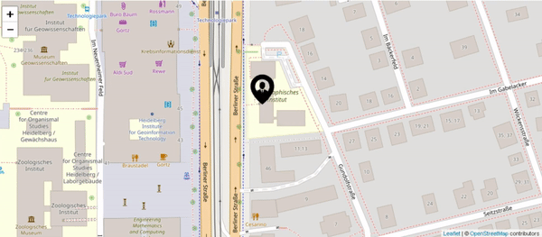

# react-leaflet-drift-marker

[](http://opensource.org/licenses/MIT)
[](https://www.npmjs.com/package/react-leaflet-drift-marker)

| Support         | Tested |         |
| --------------- | ------ | ------- |
| `react-leaflet` | v2.x   | &#9745; |
| `react-leaflet` | v3.x   | &#9745; |
| `react-leaflet` | v4.x   | &#9745; |

| react-leaflet | react-leaflet-drift-marker |
| ------------- | -------------------------- |
| v2.x          | v2.0                       |
| v3.x          | v3.x                       |
| v4.x          | v4.x                       |



A plugin for react-leaflet, that allows a marker to move smoothly instead of jump to a new position.

### For more performance use canvas or webgl options!!

## Installation

### Install via NPM

```bash
npm install --save react-leaflet-drift-marker
```

`react-leaflet-drift-marker` requires `leaflet` and `react-leaflet` as [`peerDependency`](https://docs.npmjs.com/files/package.json#peerdependencies)

```bash
npm install --save leaflet react-leaflet
```

## Usage

[](https://codesandbox.io/s/react-leaflet-drift-markerv3-nxzht?fontsize=14&hidenavigation=1&theme=dark)

Still supports all existing props from react-leaflet marker [check component](https://react-leaflet.js.org/docs/en/components#marker)

| Added Props    | Type      | Default | Description                                                             |
| -------------- | --------- | ------- | ----------------------------------------------------------------------- |
| `duration`     | `number`  | ` `     | Required, duration im miliseconds marker will take to destination point |
| `keepAtCenter` | `boolean` | `false` | Makes map view follow marker                                            |

DriftMarker Component, is the same as react-leaflet Marker Componet, but DriftMarker on update, instead of doing a `setLatLng` does a `slideTo` new position.

#### DriftMarker (with react-leaflet) example and with position generator

```javascript
import React from 'react'
import { MapContainer, TileLayer, Popup, Tooltip } from "react-leaflet";
import ReactLeafletDriftMarker from "react-leaflet-drift-marker"

function gen_position() {
    return {
        lat:(Math.random()*360-180).toFixed(8),
        lng:(Math.random()*180-90).toFixed(8):
    }
}
class SampleComp extends Component {
    // initial position
    state={ latlng:gen_position()}

    componentDidMount() {
        setTimeout(() => {// updates position every 5 sec
            this.setState({latlng:gen_position()})
        }, 5000);
    }

    render() {
        return <MapContainer center={[2.935403, 101.448205]} zoom={10}>
        <TileLayer
            attribution='&amp;copy <a href="http://osm.org/copyright">OpenStreetMap</a> contributors'
            url="https://{s}.tile.openstreetmap.org/{z}/{x}/{y}.png"
        />
        <ReactLeafletDriftMarker
            // if position changes, marker will drift its way to new position
            position={this.state.latlng}
            // time in ms that marker will take to reach its destination
            duration={1000}
            icon={iconPerson} >
            <Popup>Hi this is a popup</Popup>
            <Tooltip>Hi here is a tooltip</Tooltip>
        </ReactLeafletDriftMarker>
    </MapContainer>
    }
}
```

# License

MIT License
